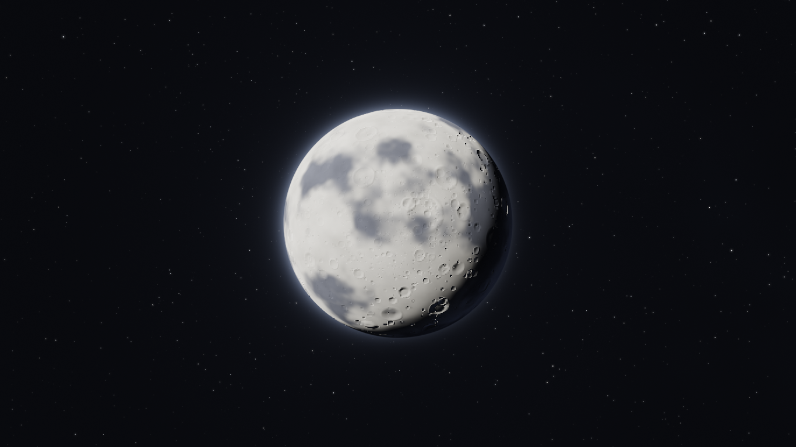

# LUA de hawkzinho

Uma lua em WebGL, num céu escuro cheio de estrelas. Arquivo único, sem
dependências e sem servidor — é só abrir o `index.html` no navegador.

## Como usar

| Ação | O que faz |
| --- | --- |
| Roda do mouse | Zoom (0.6× a 14×), ancorado no ponteiro |
| Clicar e arrastar | Gira o espaço e a lua junto; ao soltar, desliza e desacelera |
| Pinça (toque) | Zoom |

Não há botões nem texto na tela, por design.

## Como funciona

Tudo é desenhado por um único fragment shader, sem texturas nem modelos.

- **A lua** é uma esfera com relevo gerado proceduralmente: crateras de um campo
  celular 3D, em oitavas que vão sendo ligadas conforme o zoom, de acordo com o
  tamanho que um pixel ocupa na superfície. O detalhe acompanha a ampliação sem
  custar caro de longe. As normais saem do gradiente da altura (bump mapping por
  gradiente de superfície), com uma amostra de altura por pixel.
- **Os mares** são planícies de lava jovens: engolem as crateras grandes e ficam
  mais escuros e lisos. É esse contraste que impede a superfície de virar um
  campo uniforme de bolhas.
- **A iluminação** mistura Lambert com Lommel-Seeliger, que é o que dá à Lua real
  aquele aspecto de disco chapado em vez de bola sombreada nas bordas.
- **As estrelas** vivem numa grade em faces de cubo, em camadas: as mais fracas
  aparecem conforme você aproxima, mantendo a densidade na tela e o custo limitado.
  O raio delas é fixo em pixels, então continuam pontos em qualquer zoom.
- **As estrelas cadentes** são desenhadas em espaço de tela, com cabeça compacta
  e rastro que afina e some. Duas trilhas independentes dão cerca de uma a cada
  7 segundos.

O giro do céu e da lua é guardado em quatérnions, para acumular arrasto em
qualquer direção sem deriva. A lua recebe um ângulo maior que o céu para o mesmo
arrasto (÷ `MOON_TAN`): ela é uma esfera de raio 1 a 7 unidades de distância, e
esse é o fator exato que faz a superfície acompanhar o cursor 1:1, como girar um
globo com a mão.

Todo movimento tem a velocidade dividida pelo zoom, para o cenário andar igual
perto ou longe.

## Requisitos

WebGL 1 com a extensão `OES_standard_derivatives` (ou seja, qualquer navegador
dos últimos ~10 anos). A resolução de render cai sozinha se a placa não der
conta, e nunca sobe de volta — uma escada só de descida não oscila.
